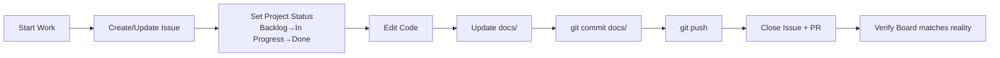

<!-- sdlc:start -->
# SDLC — Quy trình Phát triển Phần mềm (BẮT BUỘC)

Project này tuân thủ **Software Development Life Cycle (SDLC)** với các phase sau. **Mọi thay đổi code đều phải đi qua đủ các gate.**

## Phase 1: Planning & Requirements

### Trước khi làm
- **PHẢI** đọc tài liệu SDLC liên quan trước khi implement:
  - `docs/sdlc/01-SRS.md` — Yêu cầu chức năng
  - `docs/sdlc/02-Use-Cases.md` — Use cases & user stories
  - `docs/sdlc/06-Sprint-Plan.md` — Sprint hiện tại
  - `docs/sdlc/06-Sprint-Backlog.md` — Backlog items
- **PHẢI** xác nhận task nằm trong Sprint Backlog trước khi code
- **KHÔNG** implement tính năng không có trong SRS/Sprint Backlog

## Phase 2: Design

### Trước khi code kiến trúc mới
- **PHẢI** tham khảo:
  - `docs/sdlc/04-SDD.md` — Kiến trúc tổng thể
  - `docs/sdlc/03-API-Spec.md` — API design
  - `docs/sdlc/05-Database-Schema.md` — Database schema
- Nếu thay đổi architecture → **PHẢI** dùng `improve-codebase-architecture` skill để review
- Nếu thay đổi API spec → **PHẢI** cập nhật Swagger docs (`backend/docs/swagger/`)
- Nếu thay đổi DB schema → **PHẢI** viết migration file (up/down)
- **KHÔNG** phá vỡ backward compatibility mà không có approval

## Phase 3: Implementation (BẮT BUỘC)

### 3.1 Trước khi edit code
- **MUST** chạy `gitnexus_impact({target: "symbolName", direction: "upstream"})` trước khi sửa bất kỳ function/class/method nào
- **MUST** báo cáo blast radius cho user nếu risk là HIGH hoặc CRITICAL
- **CHẶT CHẼ**: Nếu không chạy impact analysis → KHÔNG được phép edit

### 3.2 Branch naming
- Format: `<type>/<sprint>-<description>`
- Ví dụ: `feat/sprint2-flashcard-review`, `fix/sprint1-login-error`
- Types: `feat`, `fix`, `refactor`, `test`, `docs`, `chore`

### 3.3 Conventional Commits (BẮT BUỘC)
- Mọi commit message **PHẢI** theo format:
  ```
  <type>(<scope>): <description>
  
  [optional body]
  ```
- Types: `feat`, `fix`, `refactor`, `test`, `docs`, `chore`, `perf`, `style`
- Scope: `backend`, `frontend`, `db`, `docs`, `infra`
- **PHẢI** dùng `conventional-commit` skill để soạn commit message
- Ví dụ: `feat(backend): add spaced repetition SM-2 algorithm`

### 3.4 Coding Standards
- **Backend (Go)**: Đọc `.claude/skills/gitnexus/gitnexus-refactoring/SKILL.md` trước khi refactor
- **KHÔNG** dùng `as any`, `@ts-ignore`, panic recovery để che lỗi
- **PHẢI** xóa backward compatibility layers sau refactor (Clean Break)
- File < 250 LOC. Nếu quá → phải split module

### 3.5 Pre-commit Checklist
- [ ] Impact analysis đã chạy
- [ ] Code sạch, không có type error
- [ ] Commit message theo conventional commit
- [ ] `detect_changes()` đã chạy, scope khớp với dự kiến

## Phase 4: Testing

### 4.1 Test-Driven Development (Khuyến nghị)
- Khi implement logic mới → **nên** dùng `test-driven-development` skill
- Red → Green → Refactor

### 4.2 Unit Tests
- **Backend**: Viết Go test cho mọi hàm service mới
- **Frontend (Flutter)**: Dùng `flutter-add-widget-test` skill cho widget mới

### 4.3 Integration Tests
- API changes → **PHẢI** update Bruno tests trong `backend/tests/bruno/`
- Chạy Bruno test suite trước khi push:
  ```bash
  cd backend/tests/bruno/tada-api && bru run --env local
  ```

### 4.4 CI/CD Gate
- File `.github/workflows/bruno.yml` tự động chạy trên push/pr vào `main`
- **KHÔNG** merge nếu CI fail

## Phase 5: Code Review

### 5.1 Trước khi tạo PR
- **PHẢI** dùng `open-code-review` skill để self-review trước
- **PHẢI** dùng `gitnexus-pr-review` skill để check impact
- **PHẢI** dùng `review-work` skill cho significant implementation (> 100 LOC)

### 5.2 Quy trình Review
- Khi gửi PR → dùng `requesting-code-review` skill
- Khi review PR → dùng `receiving-code-review` skill
- Checklist review:
  - [ ] Code đúng SRS/SDD không?
  - [ ] Impact analysis đã chạy?
  - [ ] Test đã pass?
  - [ ] Không có type error?

### 5.3 AI Detection
- **PHẢI** chạy `remove-ai-slops` skill để dọn code AI trước khi review
- **PHẢI** verify mọi AI-generated code không có placeholder/giả định sai

## Phase 6: Deployment

### Quy trình release
1. Code merged vào `main`
2. CI/CD pipeline (GitHub Actions) chạy Bruno tests
3. Docker image build & push
4. Deploy bằng `docker compose up -d`

### Versioning
- Format: `v<major>.<minor>.<patch>` (SemVer)
- Commit message quyết định version bump:
  - `feat` → minor bump
  - `fix` → patch bump
  - `BREAKING CHANGE` → major bump

## Phase 7: Maintenance & Debugging

### Bug fixes
- **PHẢI** dùng `gitnexus-debugging` skill để trace bug
- Fix minimally — **KHÔNG** refactor khi đang fix bug
- Sau 3 lần fix fail → **DỪNG** → revert → consult Oracle

### Regression
- Sau mọi change → chạy `detect_changes({scope: "compare", base_ref: "main"})`
- Nếu phát hiện unexpected side effects → fix trước khi commit

## Phase 8: Progress Sync (BẮT BUỘC)

### Nguyên tắc đồng bộ
**`docs/` là single source of truth cho tiến độ và trạng thái dự án. GitHub Issues + Project Board phải phản ánh chính xác reality.** Mọi thay đổi code hoặc tiến độ phải được đồng bộ qua 3 lớp: docs → GitHub Issues → GitHub Project.

### Khi nào phải sync
- **Sau mỗi task/issue hoàn thành** → cập nhật `docs/progress.md` + đóng issue + chuyển status trên Project Board
- **Sau mỗi sprint log** → commit + push `docs/plans/`
- **Sau mỗi thay đổi API/DB/Architecture** → cập nhật `docs/sdlc/*` tương ứng
- **Trước khi đóng issue/PR** → verify docs + board đã được cập nhật
- **Cuối mỗi phiên làm việc** → `git push` để GitHub luôn phản ánh đúng reality

### Quy trình bắt buộc



### GitHub Issue Management

#### Issue Creation
- Mọi task **PHẢI** có GitHub Issue trước khi implement
- Format title: `[<Sprint>] <description>` (ví dụ: `[Sprint 2] SRS Engine`)
- Format body: Mô tả, Yêu cầu, Sprint, Labels
- **PHẢI** gán Milestone (sprint) và Labels (backend/frontend/bug/enhancement/ops/chore)

#### Issue States
| State | Ý nghĩa | Project Board Status |
|-------|---------|---------------------|
| Open | Đang hoặc chưa làm | `Backlog` hoặc `In Progress` |
| Closed - completed | Đã hoàn thành + docs synced | `Done` |
| Closed - not planned | Won't fix / duplicate | `Done` |

### GitHub Project Board Management

Dự án có GitHub Project Board **tada-learn-english** (`https://github.com/users/DangDDT/projects/5`). Board này phải được cập nhật song song với code.

#### Board Columns
| Column | Ý nghĩa | When to move |
|--------|---------|-------------|
| `Backlog` | Chưa bắt đầu | Default khi tạo issue |
| `In Progress` | Đang làm | Khi bắt đầu implement |
| `Done` | Hoàn thành | Khi issue closed + docs synced |

#### Rules
- **PHẢI** dùng `gh` CLI hoặc GitHub MCP tools để update board — không update tay
- **PHẢI** chuyển issue từ `Backlog` → `In Progress` trước khi code
- **PHẢI** chuyển `In Progress` → `Done` sau khi issue closed + docs updated
- **KHÔNG** để issue ở `In Progress` khi chưa code xong
- **KHÔNG** move xuống `Done` nếu docs chưa được cập nhật

### Docs Sync Quy trình

1. **Edit code** → thay đổi code
2. **Sync GitHub** — cập nhật:
   - `docs/progress.md` — chuyển issue open → closed, update % hoàn thành
   - Issue trên GitHub: close issue với comment tóm tắt
   - Project Board: move sang `Done`
3. **Sync docs** — cập nhật:
   - `docs/plans/<date>-<type>.md` — ghi log tiến độ, decisions, blockers
   - `docs/sdlc/*` — cập nhật spec/schema/sdd nếu có thay đổi
4. **Commit + push** — `git add docs/ && git commit -m "docs: ..." && git push`

### GitHub MCP Tool Usage

Khi cần thao tác với GitHub Issues/Project, dùng các tools:

| Tool | Mục đích |
|------|---------|
| `github_list_issues` | Kiểm tra danh sách issues |
| `github_get_issue` | Xem chi tiết issue |
| `github_update_issue` | Close/reopen, đổi milestone/labels |
| `github_add_issue_comment` | Ghi log vào issue thread |
| `github_create_issue` | Tạo issue mới cho task |
| `github_create_pull_request` | Tạo PR |
| `github_list_pull_requests` | Kiểm tra PR status |

### Checklist trước khi kết thúc phiên

- [ ] `docs/progress.md` đã phản ánh đúng trạng thái issues hiện tại
- [ ] `docs/plans/` có log ghi lại công việc đã làm
- [ ] `docs/sdlc/` đã được cập nhật nếu có thay đổi spec/architecture
- [ ] GitHub Issues đã được close/update tương ứng
- [ ] GitHub Project Board phản ánh đúng status (Backlog/In Progress/Done)
- [ ] `git status` sạch — không có file docs nào chưa được commit
- [ ] `git push` đã chạy thành công

### KHÔNG được phép
- ❌ Đóng issue/PR mà không cập nhật progress docs + Project Board
- ❌ Để docs lệch pha với code reality (ví dụ: SRS cũ, SDD sai cấu trúc)
- ❌ Làm việc qua nhiều phiên mà không commit/push docs
- ❌ Xoá log cũ — chỉ append. Lịch sử là tài sản.
- ❌ Move issue sang `Done` trên board khi docs chưa sync
- ❌ Tạo issue mới mà không gán Milestone (sprint) và Labels

## SDLC Gate Summary

| Phase | Gate | Skill/Tool |
|-------|------|-----------|
| Plan | SRS/Sprint Backlog match | `docs/sdlc/*` |
| Design | Architecture review | `improve-codebase-architecture` |
| Implement | Impact analysis | `gitnexus-impact-analysis` |
| Implement | Conventional commit | `conventional-commit` |
| Test | Unit/Integration tests | `test-driven-development`, `flutter-add-widget-test` |
| Review | Self-review + peer review | `open-code-review`, `gitnexus-pr-review`, `review-work`, `requesting-code-review`, `receiving-code-review` |
| Deploy | CI pass | GitHub Actions |
| Maintain | Debug trace + regression | `gitnexus-debugging`, `detect_changes()` |

<!-- sdlc:end -->

<!-- gitnexus:start -->
# GitNexus — Code Intelligence

This project is indexed by GitNexus as **tada-learn-english** (389 symbols, 748 relationships, 20 execution flows). Use the GitNexus MCP tools to understand code, assess impact, and navigate safely.

> Index stale? Run `node .gitnexus/run.cjs analyze` from the project root — it auto-selects an available runner. No `.gitnexus/run.cjs` yet? `npx gitnexus analyze` (npm 11 crash → `npm i -g gitnexus`; #1939).

## Always Do

- **MUST run impact analysis before editing any symbol.** Before modifying a function, class, or method, run `impact({target: "symbolName", direction: "upstream"})` and report the blast radius (direct callers, affected processes, risk level) to the user.
- **MUST run `detect_changes()` before committing** to verify your changes only affect expected symbols and execution flows. For regression review, compare against the default branch: `detect_changes({scope: "compare", base_ref: "main"})`.
- **MUST warn the user** if impact analysis returns HIGH or CRITICAL risk before proceeding with edits.
- When exploring unfamiliar code, use `query({query: "concept"})` to find execution flows instead of grepping. It returns process-grouped results ranked by relevance.
- When you need full context on a specific symbol — callers, callees, which execution flows it participates in — use `context({name: "symbolName"})`.

## Never Do

- NEVER edit a function, class, or method without first running `impact` on it.
- NEVER ignore HIGH or CRITICAL risk warnings from impact analysis.
- NEVER rename symbols with find-and-replace — use `rename` which understands the call graph.
- NEVER commit changes without running `detect_changes()` to check affected scope.

## Resources

| Resource | Use for |
|----------|---------|
| `gitnexus://repo/tada-learn-english/context` | Codebase overview, check index freshness |
| `gitnexus://repo/tada-learn-english/clusters` | All functional areas |
| `gitnexus://repo/tada-learn-english/processes` | All execution flows |
| `gitnexus://repo/tada-learn-english/process/{name}` | Step-by-step execution trace |

## CLI

| Task | Read this skill file |
|------|---------------------|
| Understand architecture / "How does X work?" | `.claude/skills/gitnexus/gitnexus-exploring/SKILL.md` |
| Blast radius / "What breaks if I change X?" | `.claude/skills/gitnexus/gitnexus-impact-analysis/SKILL.md` |
| Trace bugs / "Why is X failing?" | `.claude/skills/gitnexus/gitnexus-debugging/SKILL.md` |
| Rename / extract / split / refactor | `.claude/skills/gitnexus/gitnexus-refactoring/SKILL.md` |
| Tools, resources, schema reference | `.claude/skills/gitnexus/gitnexus-guide/SKILL.md` |
| Index, status, clean, wiki CLI commands | `.claude/skills/gitnexus/gitnexus-cli/SKILL.md` |

<!-- gitnexus:end -->