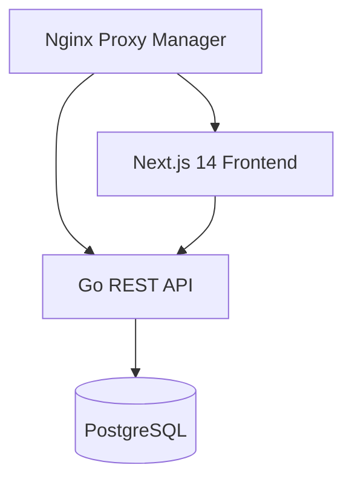
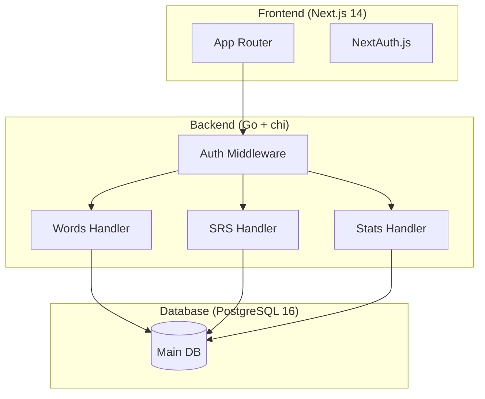

# Software Requirements Specification (SRS)

## Tada Learn English

| Field | Value |
|---|---|
| **Project Name** | Tada Learn English |
| **Version** | 1.0.0 |
| **Repository** | https://github.com/DangDDT/tada-learn-english |

## 1. Introduction

Tada Learn English is a self-hosted web application for English vocabulary learning and management, inspired by LearnMyWords.com. It provides intelligent vocabulary storage, spaced repetition (SRS), multiple learning modes, interactive games, and progress analytics.

### Scope
- **In Scope:** CRUD vocabulary, Spaced Repetition System (SRS), Flashcard learning, Dictation, Translation, Text Analysis, 3 vocabulary games, Progress statistics with CEFR, Multi-user support.
- **Out of Scope (Sprint 1):** Full games, Text analysis, CEFR analytics, Mobile apps.

### User Roles
| Role | Description |
|---|---|
| Learner | Primary user — adds, learns, reviews vocabulary |
| Admin | Manages users, system configuration (future) |

## 2. Product Overview

## 3. Functional Requirements

### FR-1: Vocabulary CRUD
| ID | Requirement | Priority | Sprint |
|---|---|---|---|
| FR-1.1 | Add new word with: word, IPA, meaning, part of speech, example, CEFR level, tags | Must | Sprint 1 |
| FR-1.2 | Edit word details | Must | Sprint 1 |
| FR-1.3 | Soft-delete word | Must | Sprint 1 |
| FR-1.4 | Search words (fuzzy on text + meaning) | Must | Sprint 1 |
| FR-1.5 | Bulk import via CSV/JSON | Should | Sprint 2 |
| FR-1.6 | Auto-fill from dictionary API | Could | Sprint 3 |

### FR-2: Spaced Repetition (SRS)
| ID | Requirement | Priority | Sprint |
|---|---|---|---|
| FR-2.1 | 5-band memory model: New → Learning → Reviewing → Mature → Mastered | Must | Sprint 2 |
| FR-2.2 | Auto-schedule at intervals: 1d, 3d, 7d, 14d, 30d | Must | Sprint 2 |
| FR-2.3 | User rates recall: Easy/Medium/Hard | Must | Sprint 2 |
| FR-2.4 | Daily review queue with count | Must | Sprint 2 |
| FR-2.5 | SRS statistics: bands, streak, accuracy | Should | Sprint 2 |

### FR-3: Learning Modes
| ID | Requirement | Priority | Sprint |
|---|---|---|---|
| FR-3.1 | Flashcard: show word → flip to meaning + audio | Must | Sprint 2 |
| FR-3.2 | Vocabulary Quiz: meaning → type word | Must | Sprint 2 |
| FR-3.3 | Spelling Dictation: fill missing word in sentence | Should | Sprint 3 |
| FR-3.4 | Sentence Dictation: listen and type | Should | Sprint 3 |
| FR-3.5 | Translation: VI → EN | Should | Sprint 3 |
| FR-3.6 | Text Analyzer: paste text → extract words with CEFR | Could | Sprint 3 |

### FR-4: Games
| ID | Requirement | Priority | Sprint |
|---|---|---|---|
| FR-4.1 | Word Chain: play vs bot | Could | Sprint 4 |
| FR-4.2 | Word Builder: find words from given letters | Could | Sprint 4 |
| FR-4.3 | Unscramble: unscramble letters to form word | Could | Sprint 4 |

### FR-5: Progress & Analytics
| ID | Requirement | Priority | Sprint |
|---|---|---|---|
| FR-5.1 | Dashboard: total words, today's activity, streak | Must | Sprint 5 |
| FR-5.2 | CEFR distribution chart | Should | Sprint 5 |
| FR-5.3 | Daily activity chart | Should | Sprint 5 |
| FR-5.4 | Export data (JSON/CSV) | Could | Sprint 5 |

### FR-6: Auth & Multi-User
| ID | Requirement | Priority | Sprint |
|---|---|---|---|
| FR-6.1 | Register + login (email/password) | Must | Sprint 1 |
| FR-6.2 | JWT session management | Must | Sprint 1 |
| FR-6.3 | Password reset flow | Should | Sprint 1 |
| FR-6.4 | User isolation (each user sees own vocabulary) | Should | Sprint 5 |

### FR-7: Pronunciation (TTS)
| ID | Requirement | Priority | Sprint |
|---|---|---|---|
| FR-7.1 | Play audio for any word | Should | Sprint 2 |
| FR-7.2 | Multiple accents (US/UK) | Could | Sprint 3 |

## 4. Non-Functional Requirements

### Performance
| ID | Target |
|---|---|
| NFR-1.1 | API p95 < 200ms |
| NFR-1.2 | LCP < 2s |
| NFR-1.3 | Concurrent users: 10 (MVP) |
| NFR-1.4 | Max vocabulary per user: 20,000 words |

### Security
- JWT on all endpoints (except register/login)
- bcrypt password hashing (cost 12)
- HTTPS via Nginx PM + Cloudflare
- Parameterized queries (sqlc)
- CORS restricted to frontend origin

## 5. System Architecture

## 6. Technology Stack

| Layer | Technology | Version |
|---|---|---|
| Frontend | Next.js (App Router) + TypeScript | 14.x |
| Styling | Tailwind CSS + shadcn/ui | 3.x |
| Auth (FE) | NextAuth.js | 4.x |
| Backend | Go | 1.22+ |
| Router | chi | 5.x |
| Database | PostgreSQL + pgvector + pg_trgm | 16 |
| DB Driver | pgx | 5.x |
| SQL Gen | sqlc | 1.x |
| API Docs | swaggo/swag | 1.x |
| TTS | Web Speech API / edge-tts | - |
| Deployment | Docker Compose | - |
| Reverse Proxy | Nginx Proxy Manager | - |
| DNS | Cloudflare | - |

## 7. Constraints

- Self-hosted on VPS (dangddt.io.vn)
- Free/open-source tools only (MVP)
- Single developer (DangDDT)
- PostgreSQL already running on host
- VPS: 2GB RAM, 20GB disk minimum