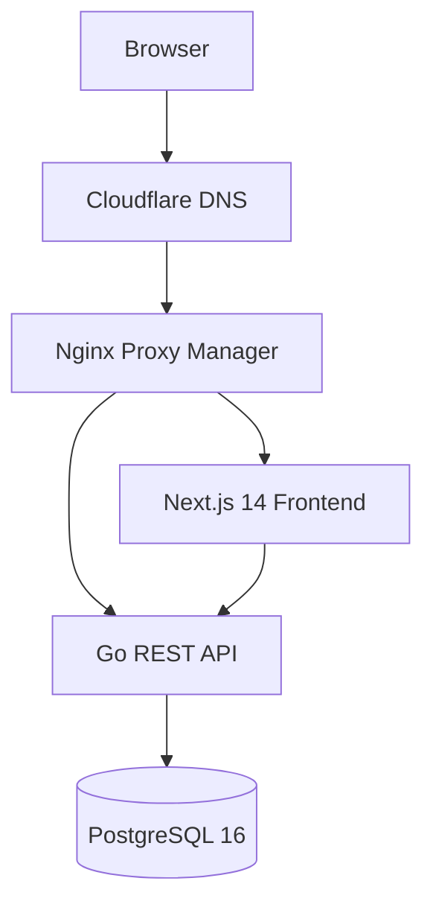
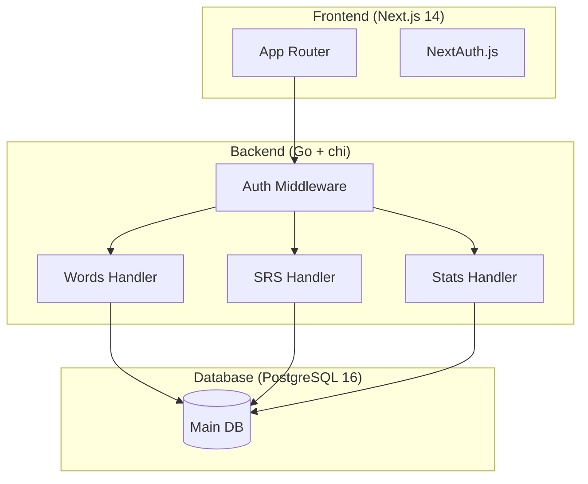

# Software Requirements Specification (SRS)

## Tada Learn English

| Field | Value |
|---|---|
| **Project Name** | Tada Learn English |
| **Version** | 1.0.0 |
| **Repository** | https://github.com/DangDDT/tada-learn-english |
| **Related Docs** | [PRD](00-PRD.md), [Use Cases](02-Use-Cases.md), [API Spec](03-API-Spec.md), [SDD](04-SDD.md) |

## 1. Introduction

Tada Learn English is a self-hosted web application for English vocabulary learning and management, inspired by LearnMyWords.com. It provides intelligent vocabulary storage, spaced repetition (SRS), multiple learning modes, interactive games, and progress analytics.

### Scope

| Area | In Scope | Out of Scope |
|------|----------|-------------|
| **Vocabulary** | CRUD, search, bulk import | Mobile app (future) |
| **Learning** | SRS, Flashcards, Quiz, Dictation, Translation | AI-generated examples (future) |
| **Analysis** | Text analyzer with CEFR, Progress charts | Semantic search (future) |
| **Games** | Word Chain, Word Builder, Unscramble | Social features (future) |
| **Auth** | Email/password, JWT, password reset | OAuth/Social login (future) |
| **Deployment** | Docker Compose, VPS, Nginx PM | Kubernetes, auto-scaling |

### User Roles

| Role | Description |
|------|-------------|
| Learner | Primary user — adds, learns, reviews vocabulary |
| Admin | Manages users, system configuration (future sprint) |

## 2. Product Overview

## 3. Functional Requirements

### FR-1: Vocabulary CRUD

| ID | Requirement | Priority | Sprint | Acceptance Criteria |
|----|------------|----------|--------|-------------------|
| FR-1.1 | Add new word with: word, IPA, meaning, part of speech, example, CEFR level, tags | Must | Sprint 1 | `POST /api/v1/words` returns 201 with word object. Duplicate word (same user + same word) returns 409. Missing word or meaning returns 400. Word max 255 chars. |
| FR-1.2 | Edit word details (partial update) | Must | Sprint 1 | `PUT /api/v1/words/{id}` updates only sent fields. Returns 200 with updated object. Renaming to existing word returns 409. Non-existent id returns 404. |
| FR-1.3 | Soft-delete word | Must | Sprint 1 | `DELETE /api/v1/words/{id}` returns 204. `GET /api/v1/words` no longer returns deleted word. `GET /api/v1/words/{id}` on deleted returns 404. |
| FR-1.4 | Search words (fuzzy on text + meaning) | Must | Sprint 1 | `GET /api/v1/words?q=ephe` returns words matching "ephemeral". Supports ILIKE search on word and meaning fields. Empty query returns all words. |
| FR-1.5 | Bulk import via CSV | Should | Sprint 2 | `POST /api/v1/words/import` accepts CSV file. Returns created + skipped counts. Duplicate words silently skipped. Invalid rows logged but don't fail entire import. |
| FR-1.6 | Auto-fill from dictionary API | Could | Sprint 3 | TBD — requires external dictionary API integration |

### FR-2: Spaced Repetition (SRS)

| ID | Requirement | Priority | Sprint | Acceptance Criteria |
|----|------------|----------|--------|-------------------|
| FR-2.1 | 5-band memory model: New → Learning → Reviewing → Mature → Mastered | Must | Sprint 2 | Each word has exactly one SRS band. Bands transition only via Easy/Medium/Hard ratings. New words start in "new" band. |
| FR-2.2 | Auto-schedule at intervals: 1d, 3d, 7d, 14d, 30d | Must | Sprint 2 | New word has next_review_at = now + 1d. Easy rating multiplies interval by 2.5. Medium keeps interval. Hard multiplies by 0.5. next_review_at is never in the past after rating. |
| FR-2.3 | User rates recall: Easy/Medium/Hard | Must | Sprint 2 | `POST /api/v1/srs/review` accepts {"rating": "easy"|"medium"|"hard"}. Returns updated SRS state. Invalid rating returns 400. |
| FR-2.4 | Daily review queue with count | Must | Sprint 2 | `GET /api/v1/srs/queue` returns words where next_review_at <= now. Returns due_count + ordered queue. Empty queue when no words due. |
| FR-2.5 | SRS statistics: bands, streak, accuracy | Should | Sprint 2 | `GET /api/v1/srs/stats` returns band counts, total words, reviewed_today, streak_days, accuracy_rate. Streak resets if no review in 24h. |

### FR-3: Learning Modes

| ID | Requirement | Priority | Sprint | Acceptance Criteria |
|----|------------|----------|--------|-------------------|
| FR-3.1 | Flashcard: show word → flip to meaning + audio | Must | Sprint 2 | `GET /api/v1/study/flashcard/queue` returns word front (word, pronunciation). Flip reveals meaning, IPA, example. Audio endpoint returns playable mpeg. |
| FR-3.2 | Vocabulary Quiz: meaning → type word | Must | Sprint 2 | `POST /api/v1/study/quiz` returns meaning prompt. `POST /api/v1/study/quiz/check` validates typed answer (case-insensitive). Returns correct/incorrect with correct answer. |
| FR-3.3 | Spelling Dictation: fill missing word in sentence | Should | Sprint 3 | `POST /api/v1/study/dictation/spelling` returns sentence with blank. `POST /api/v1/study/dictation/check` validates filled word. Partial match >70% accepted as correct. |
| FR-3.4 | Sentence Dictation: listen and type | Should | Sprint 3 | TTS audio plays sentence. `POST /api/v1/study/dictation/sentence/check` compares typed vs expected. Word-level matching, not exact string. |
| FR-3.5 | Translation: VI → EN | Should | Sprint 3 | `POST /api/v1/study/translate` shows Vietnamese prompt. User types English translation. Match against stored word. Multiple correct answers accepted if applicable. |
| FR-3.6 | Text Analyzer: paste text → extract words with CEFR | Could | Sprint 3 | `POST /api/v1/study/analyze` accepts English text. Returns list of unique words with CEFR level (A1-C2). Unknown words marked as "unclassified". Non-English chars filtered. |

### FR-4: Games

| ID | Requirement | Priority | Sprint | Acceptance Criteria |
|----|------------|----------|--------|-------------------|
| FR-4.1 | Word Chain: play vs bot | Could | Sprint 4 | `POST /api/v1/games/word-chain/start` initializes game. Bot responds with valid word starting with last letter. Player turn validated against dictionary. Invalid words rejected. |
| FR-4.2 | Word Builder: find words from given letters | Could | Sprint 4 | `POST /api/v1/games/word-builder/play` accepts set of letters. Returns all valid words that can be formed. Words validated against user's vocabulary + common dictionary. |
| FR-4.3 | Unscramble: unscramble letters to form word | Could | Sprint 4 | `POST /api/v1/games/unscramble/play` returns scrambled letters. `POST /api/v1/games/unscramble/check` validates answer. Hint system reveals letters progressively. |

### FR-5: Progress & Analytics

| ID | Requirement | Priority | Sprint | Acceptance Criteria |
|----|------------|----------|--------|-------------------|
| FR-5.1 | Dashboard: total words, today's activity, streak | Must | Sprint 5 | `GET /api/v1/stats/dashboard` returns total_words, reviewed_today, streak_days, words_added_today. All counters reset appropriately per day boundary (UTC). |
| FR-5.2 | CEFR distribution chart | Should | Sprint 5 | `GET /api/v1/stats/cefr-distribution` returns count per CEFR level (A1-C2 + unclassified). Data sums to total words. Empty levels return 0 not omitted. |
| FR-5.3 | Daily activity chart | Should | Sprint 5 | `GET /api/v1/stats/daily-activity?days=30` returns [{date, reviewed, added}] for last N days. Missing dates return 0 activity. |
| FR-5.4 | Export data (JSON/CSV) | Could | Sprint 5 | `GET /api/v1/export?format=csv` returns downloadable file. CSV has headers. JSON returns array of word objects with all fields. Export respects user isolation. |

### FR-6: Auth & Multi-User

| ID | Requirement | Priority | Sprint | Acceptance Criteria |
|----|------------|----------|--------|-------------------|
| FR-6.1 | Register + login (email/password) | Must | Sprint 1 | `POST /api/v1/auth/register` creates user. `POST /api/v1/auth/login` returns JWT + refresh token. Duplicate email returns 409. Weak password (<8 chars, no uppercase/digit) returns 400. |
| FR-6.2 | JWT session management | Must | Sprint 1 | Access token expires in 1h. Refresh token valid for 7d. `POST /api/v1/auth/refresh` issues new access token. Expired access token returns 401. Revoked refresh token returns 401. |
| FR-6.3 | Password reset flow | Should | Sprint 1 | `POST /api/v1/auth/forgot-password` sends reset token (stored in password_reset_tokens). `POST /api/v1/auth/reset-password` accepts token + new password. Token expires after 1h. Token single-use only. |
| FR-6.4 | User isolation (each user sees own vocabulary) | Should | Sprint 5 | Every word/SRS endpoint filters by JWT user_id. User A cannot see User B's words. Admin endpoint (future) can see all. |

### FR-7: Pronunciation (TTS)

| ID | Requirement | Priority | Sprint | Acceptance Criteria |
|----|------------|----------|--------|-------------------|
| FR-7.1 | Play audio for any word | Should | Sprint 2 | `GET /api/v1/tts/{word}` returns audio/mpeg. Non-empty audio bytes returned. Invalid characters (numbers, symbols) return 400. |
| FR-7.2 | Multiple accents (US/UK) | Could | Sprint 3 | `GET /api/v1/tts/{word}?accent=uk` returns UK accent. Default is US if accent omitted. Unsupported accent falls back to US. |

## 4. Non-Functional Requirements

### NFR-1: Performance

| ID | Target | Measurement |
|----|--------|-------------|
| NFR-1.1 | API p95 latency < 200ms (excluding network) | `curl -w '%{time_total}'` averaged over 50 requests |
| NFR-1.2 | Frontend LCP < 2.0s | Lighthouse desktop report |
| NFR-1.3 | Concurrent users: 10 (MVP) | k6 or hey load test with 10 concurrent connections |
| NFR-1.4 | Max vocabulary per user: 20,000 words | Verified with seed data + pagination test |
| NFR-1.5 | SRS queue query < 50ms with 20k words | EXPLAIN ANALYZE on review queue query |

### NFR-2: Security

| ID | Requirement | Verification |
|----|-------------|-------------|
| NFR-2.1 | All endpoints except register/login require Bearer JWT | Bruno test without token returns 401 |
| NFR-2.2 | bcrypt password hashing with cost factor >= 12 | `grep -r "bcrypt" backend/` confirms cost 12 |
| NFR-2.3 | HTTPS enforced via Nginx PM + Cloudflare Full SSL | curl without TLS returns redirect |
| NFR-2.4 | All DB queries use parameterized statements via sqlc/pgx | Code review — no string concatenation in SQL |
| NFR-2.5 | CORS restricted to frontend origin | `curl -H "Origin: https://evil.com"` returns no CORS headers |
| NFR-2.6 | JWT signed with HS256, secret >= 256 bits | Config validation on startup |
| NFR-2.7 | Rate limiting: 100 req/min authenticated, 10 req/min unauthenticated | Burst test with 200 requests returns 429 after limit |
| NFR-2.8 | No secrets (passwords, tokens, keys) in git history | `gitleaks` scan passes |

### NFR-3: Availability & Reliability

| ID | Requirement | Target |
|----|-------------|--------|
| NFR-3.1 | System uptime (excluding planned maintenance) | 99% monthly |
| NFR-3.2 | Database backup frequency | Daily at 02:00 UTC |
| NFR-3.3 | Backup retention | 30 days |
| NFR-3.4 | Recovery Time Objective (RTO) | < 1 hour |
| NFR-3.5 | Recovery Point Objective (RPO) | < 24 hours |
| NFR-3.6 | Health check endpoint returns 200 | `GET /api/v1/health` returns OK + DB connectivity |

### NFR-4: Maintainability

| ID | Requirement |
|----|-------------|
| NFR-4.1 | Source file size < 250 LOC per file |
| NFR-4.2 | Go module structure follows standard `cmd/` `internal/` layout |
| NFR-4.3 | Database migrations are reversible (up + down) |
| NFR-4.4 | All API changes update Swagger docs before merge |
| NFR-4.5 | Backward compatibility maintained within same major version |
| NFR-4.6 | Docker build produces reproducible images (no `latest` tags in production) |

### NFR-5: Accessibility & Browser Support

| ID | Requirement |
|----|-------------|
| NFR-5.1 | Frontend targets WCAG 2.1 AA compliance |
| NFR-5.2 | Supported browsers: Chrome 100+, Firefox 120+, Safari 16+ |
| NFR-5.3 | Responsive layout: mobile (320px) to desktop (1920px) |
| NFR-5.4 | Keyboard navigable (Tab, Enter, Escape for modals) |

## 5. System Architecture

## 6. Technology Stack

| Layer | Technology | Version |
|---|---|---|
| Frontend | Next.js (App Router) + TypeScript | 14.x |
| Styling | Tailwind CSS + shadcn/ui | 3.x |
| Auth (FE) | NextAuth.js | 4.x |
| Backend | Go | 1.25 |
| Router | chi | 5.x |
| Database | PostgreSQL 16 + pgvector + pg_trgm | 16 |
| DB Driver | pgx | 5.x |
| API Docs | swaggo/swag | 1.x |
| TTS | Web Speech API / edge-tts | - |
| CI | GitHub Actions | - |
| Deployment | Docker Compose | - |
| Reverse Proxy | Nginx Proxy Manager | - |
| DNS | Cloudflare | - |

## 7. Constraints

- Self-hosted on VPS (dangddt.io.vn)
- Free/open-source tools only (MVP)
- Single developer (DangDDT)
- PostgreSQL already running on host
- VPS: 2GB RAM, 20GB disk minimum
- No external API dependencies for core functionality
