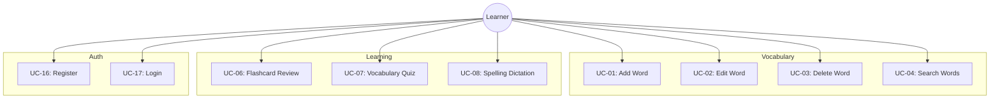

# Use Cases & User Stories

## Tada Learn English

| Field | Value |
|---|---|
| **Project** | Tada Learn English |
| **Version** | 1.0.0 |

## 1. Actor Catalog

| Actor | Description |
|---|---|
| Learner | Primary user. Adds vocabulary, studies via learning modes, plays games, tracks progress. |
| Admin | Manages system configuration, user accounts. Same person as Learner in MVP. |
| System | Automated: SRS scheduling, daily review notifications, backups. |

## 2. Use Case Diagram

## 3. Key Use Cases

### UC-01: Add Word
| Field | Detail |
|---|---|
| Actor | Learner |
| Priority | Must (Sprint 1) |
| Precondition | Authenticated |
| Basic Flow | 1. Enter word text. 2. System suggests auto-fill (optional). 3. Fill meaning, IPA, part of speech, examples, CEFR, tags. 4. Save. 5. System validates and saves. 6. Auto-creates SRS state (band: New). |
| Exception | Word exists → duplicate warning |

### UC-06: Flashcard Review
| Field | Detail |
|---|---|
| Actor | Learner |
| Priority | Must (Sprint 2) |
| Basic Flow | 1. Open Study mode. 2. System shows word (front). 3. User recalls meaning. 4. Tap to flip → meaning + audio. 5. Rate: Easy/Medium/Hard. 6. System updates SRS band and schedules next review. |
| SRS Logic | Easy: promote band, ×2.5 interval. Medium: stay, ×1.0. Hard: demote, ×0.5. |

## 4. User Stories by Sprint

### Sprint 1 — MVP Core
| ID | Story | Points |
|---|---|---|
| US-01 | Add words with meaning, IPA, examples | 5 |
| US-02 | Search vocabulary (fuzzy) | 3 |
| US-03 | Edit and delete words | 3 |
| US-04 | Register and login (email+password) | 8 |
| US-05 | Swagger API docs | 3 |

### Sprint 2 — SRS & Learning
| ID | Story | Points |
|---|---|---|
| US-06 | Auto-schedule reviews (SRS) | 8 |
| US-07 | Flashcard review with rating | 5 |
| US-08 | Vocabulary quiz (meaning→word) | 5 |
| US-09 | Audio pronunciation (TTS) | 3 |
| US-10 | CSV import words | 5 |

### Sprint 3 — Practice Modes
| ID | Story | Points |
|---|---|---|
| US-11 | Spelling dictation | 5 |
| US-12 | Translation practice (VI→EN) | 5 |
| US-13 | Text analyzer with CEFR | 8 |

### Sprint 4 — Games
| ID | Story | Points |
|---|---|---|
| US-14 | Word Chain vs bot | 8 |
| US-15 | Word Builder game | 5 |
| US-16 | Unscramble game | 5 |

### Sprint 5 — Analytics & Multi-User
| ID | Story | Points |
|---|---|---|
| US-17 | Dashboard with charts | 8 |
| US-18 | Data export (CSV/JSON) | 3 |
| US-19 | Multi-user isolation | 8 |