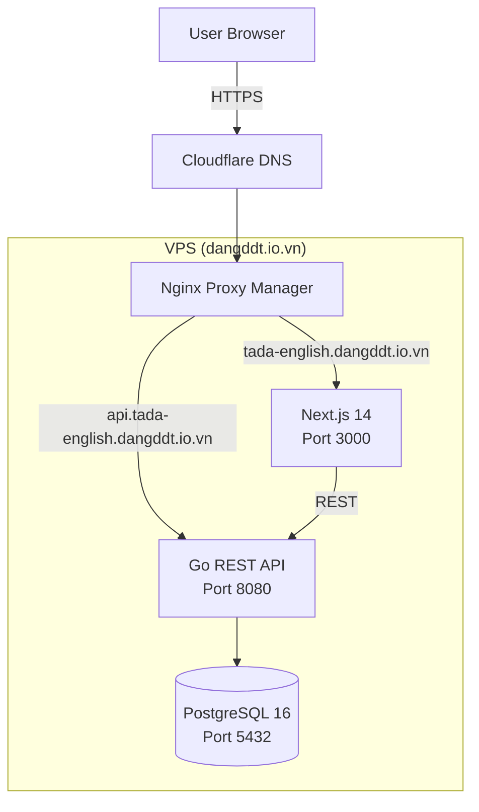
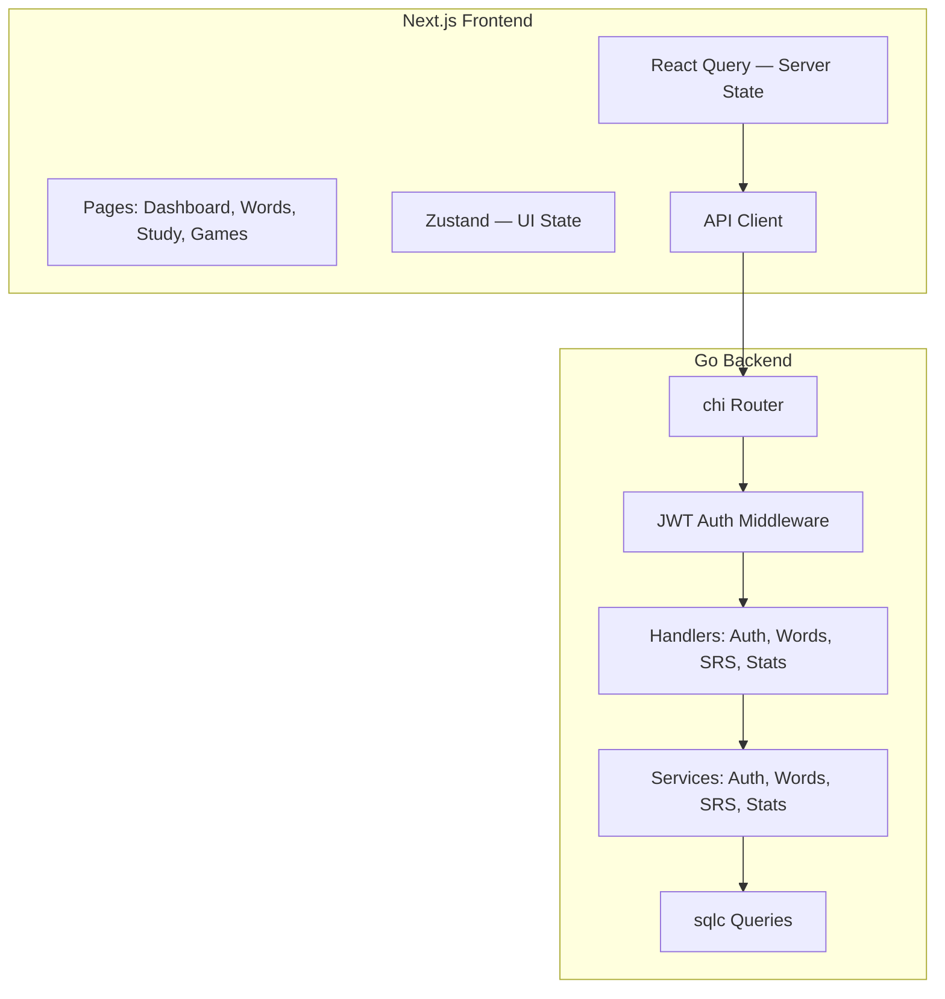
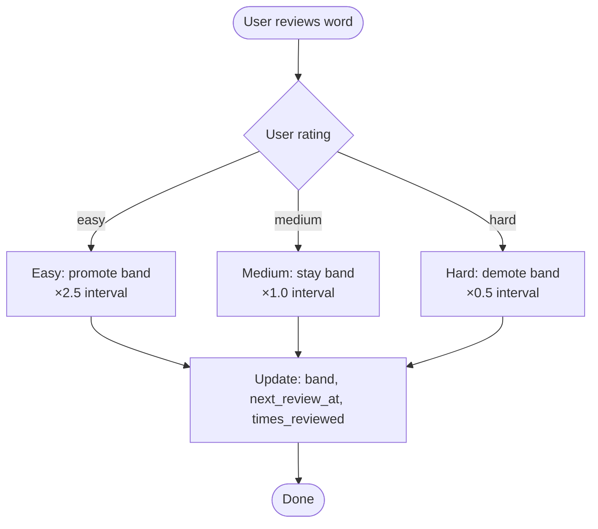
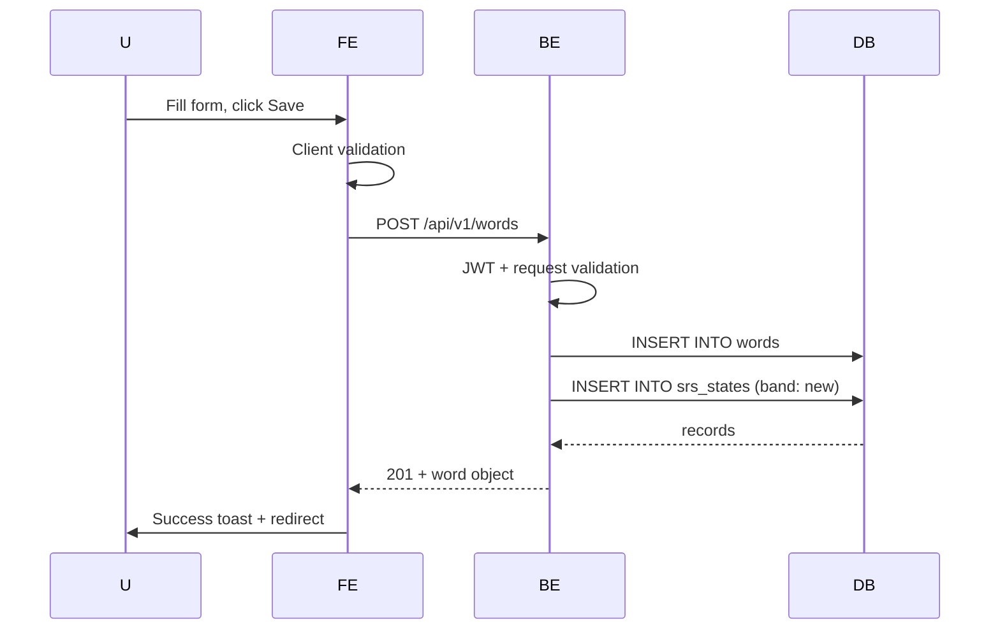
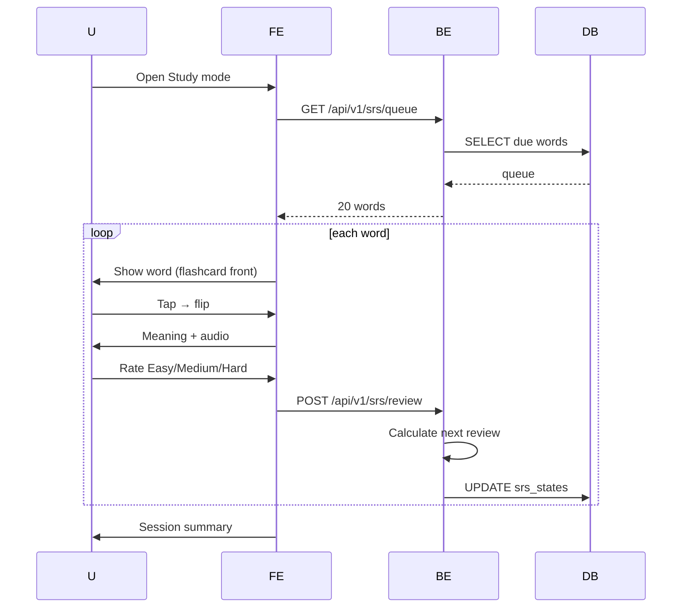

# Software Design Document (SDD)

## Tada Learn English

| Field | Value |
|---|---|
| **Version** | 1.0.0 |

## 1. Architecture Overview

### Deployment Architecture


### Component Architecture


## 2. Backend Design (Go)

### Project Structure
```
backend/
├── cmd/server/main.go       # Entry point
├── internal/
│   ├── config/config.go      # Env loading
│   ├── middleware/
│   │   ├── auth.go           # JWT validation
│   │   ├── cors.go           # CORS
│   │   └── ratelimit.go      # Rate limiting
│   ├── handler/
│   │   ├── auth.go           # Auth endpoints
│   │   ├── words.go          # Word CRUD
│   │   ├── srs.go            # SRS review/queue
│   │   └── stats.go          # Dashboard
│   ├── service/
│   │   ├── auth.go           # Business logic
│   │   ├── words.go
│   │   └── srs.go            # SM-2 algorithm
│   └── model/
│       ├── word.go
│       └── user.go
├── db/
│   ├── migrations/           # SQL files
│   └── queries/              # sqlc queries
├── Dockerfile
├── go.mod
└── go.sum
```

### SRS Algorithm (SM-2 Based)


**Band intervals:** new (1d) → learning (3d) → reviewing (7d) → mature (14d) → mastered (30d)

## 3. Frontend Design (Next.js 14)

### Route Structure (App Router)
```
src/app/
├── layout.tsx                  # Root layout
├── page.tsx                    # Dashboard
├── (auth)/login/page.tsx       # Login
├── (auth)/register/page.tsx    # Register
├── (dashboard)/
│   ├── layout.tsx              # Auth layout + sidebar
│   ├── words/
│   │   ├── page.tsx            # Word list + search
│   │   ├── [id]/page.tsx       # Word detail + edit
│   │   ├── add/page.tsx        # Add new word
│   │   └── import/page.tsx     # CSV import
│   ├── study/
│   │   ├── page.tsx            # Study mode selector
│   │   ├── flashcard/page.tsx  # Flashcard mode
│   │   └── quiz/page.tsx       # Quiz mode
│   ├── games/
│   │   ├── word-chain/page.tsx
│   │   ├── word-builder/page.tsx
│   │   └── unscramble/page.tsx
│   └── stats/page.tsx          # Progress dashboard
├── components/
│   ├── ui/                     # shadcn/ui
│   ├── words/                  # WordCard, SearchBar
│   └── study/                  # FlashcardDeck, QuizQuestion
├── lib/
│   ├── api-client.ts           # Typed API client
│   └── auth.ts                 # NextAuth config
└── hooks/
    ├── use-words.ts
    ├── use-srs.ts
    └── use-stats.ts
```

### State Management
- **Server State:** React Query for API data (words, SRS queue, stats)
- **Client State:** Zustand for UI (sidebar, theme, search query, study session)
- **Auth State:** NextAuth.js (useSession hook)

## 4. Data Flows

### Add Word Flow


### SRS Review Flow


## 5. Security Design
- JWT: HS256, access token 1h, refresh token 7d
- Passwords: bcrypt cost factor 12
- SQL injection: sqlc parameterized queries
- CORS: restricted to frontend origin
- Rate limiting: 100 req/min auth'd, 10 req/min unauth'd
- HTTPS via Nginx Proxy Manager + Cloudflare Full SSL

## 6. Docker Compose
```yaml
services:
  frontend:
    build: ./frontend
    ports: ["3000:3000"]
    environment:
      - NEXT_PUBLIC_API_URL=https://api.tada-english.dangddt.io.vn
  backend:
    build: ./backend
    ports: ["8080:8080"]
    environment:
      - DATABASE_URL=postgres://tada:pass@db:5432/tada_english
      - JWT_SECRET=${JWT_SECRET}
    depends_on:
      db: {condition: service_healthy}
  db:
    image: pgvector/pgvector:pg16
    ports: ["5432:5432"]
    environment:
      - POSTGRES_USER=tada
      - POSTGRES_DB=tada_english
    volumes: [pgdata:/var/lib/postgresql/data]
volumes:
  pgdata:
```

## 7. Nginx Routes
| Domain | Target |
|---|---|
| tada-english.dangddt.io.vn | localhost:3000 |
| api.tada-english.dangddt.io.vn | localhost:8080 |