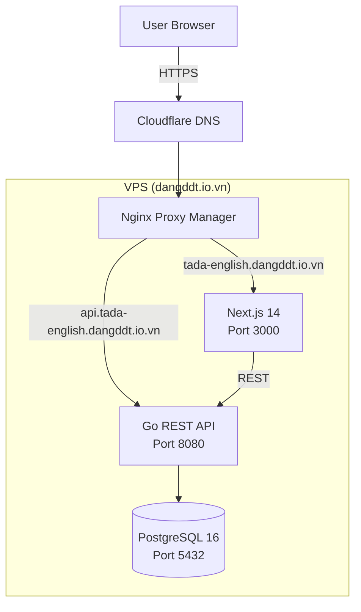
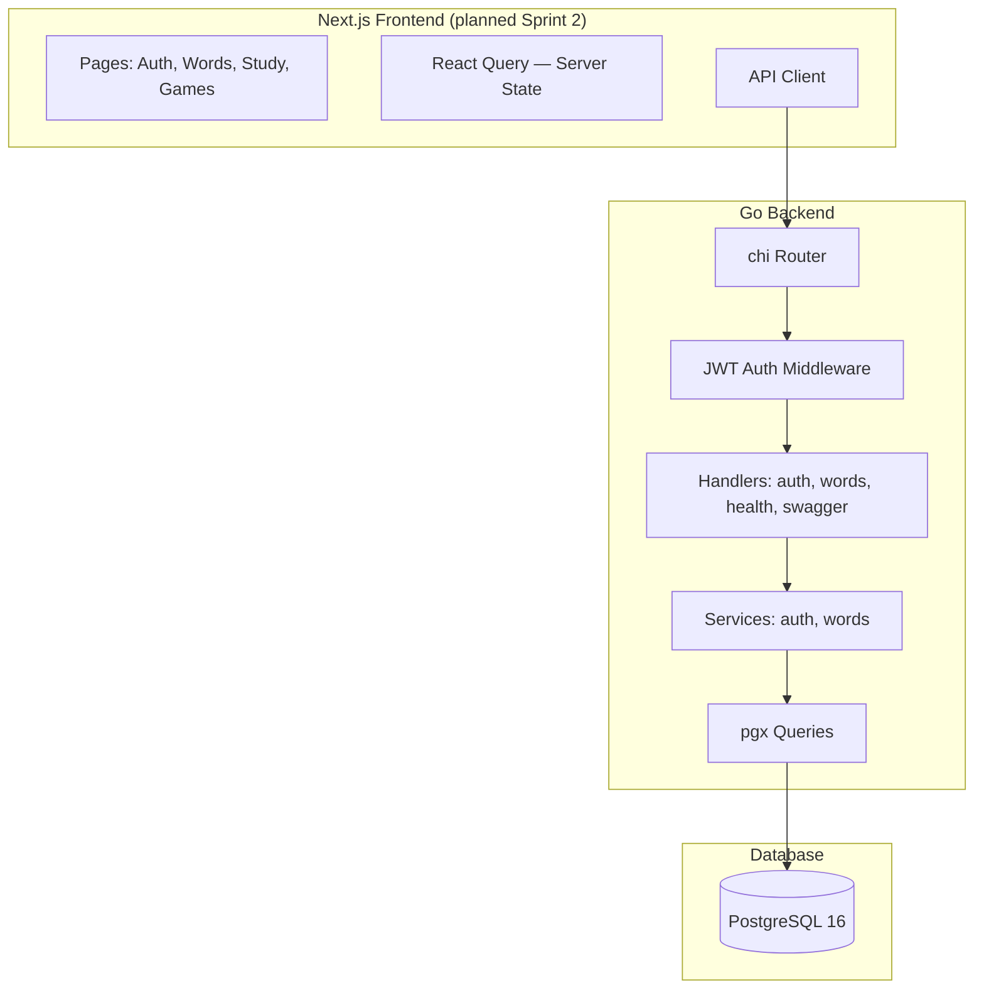
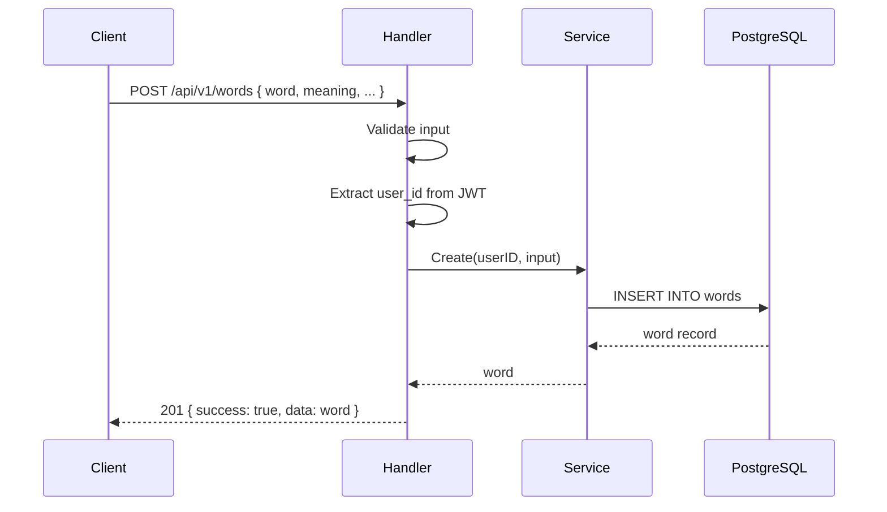
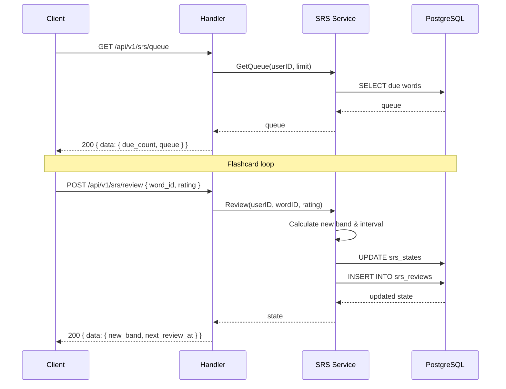

# Software Design Document (SDD)

## Tada Learn English

| Field | Value |
|-------|-------|
| **Version** | 1.0.1 |
| **Last Updated** | 2026-07-10 |
| **Related** | [PRD](00-PRD.md), [SRS](01-SRS.md), [API Spec](03-API-Spec.md) |

## 1. Architecture Overview

### Deployment Architecture



### Component Architecture



## 2. Backend Design (Go)

### Project Structure (Actual)

```
backend/
├── cmd/server/main.go            # Entry point
├── internal/
│   ├── config/config.go           # Env loading (JWT secret, DB URL, port)
│   ├── middleware/
│   │   └── auth.go                # JWT validation middleware
│   ├── handler/
│   │   ├── auth.go                # Auth endpoints (register, login, refresh, forgot/reset)
│   │   ├── health.go              # Health check endpoint
│   │   ├── swagger.go             # Swagger UI handler
│   │   └── words.go               # Word CRUD endpoints
│   ├── service/
│   │   ├── auth.go                # Auth business logic (register, login, JWT, password reset)
│   │   └── words.go               # Word business logic (CRUD, search, import)
│   └── model/
│       └── models.go              # All data models (User, Word, WordWithSRS, SRSState)
├── db/
│   └── migrations/
│       └── 000002_password_reset_tokens.{up,down}.sql
├── tests/
│   └── bruno/                     # Bruno API test collection
├── Dockerfile
├── go.mod
└── go.sum
```

### Future Structure (Post-Sprint 2)

```
backend/
├── internal/
│   ├── handler/
│   │   ├── auth.go                # + forgot/reset endpoints
│   │   ├── words.go               # + import endpoint
│   │   ├── srs.go                 # NEW: SRS review/queue/stats
│   │   ├── study.go               # NEW: flashcard, quiz
│   │   └── stats.go               # NEW: dashboard, CEFR, export
│   ├── service/
│   │   ├── srs.go                 # NEW: SM-2 algorithm
│   │   ├── study.go               # NEW: flashcard, quiz logic
│   │   └── stats.go               # NEW: analytics
│   └── model/
│       └── models.go              # Extended models
```

### Layered Architecture

```
Handler (HTTP) → Service (Business Logic) → pgx (Database)
     │                    │                        │
     │                    │                        │
  Input validation    SM-2 algorithm          Parameterized SQL
  HTTP parsing        Auth logic              Connection pool
  Response format     Error handling          Transactions
```

### Error Handling Strategy

```
Custom error types:
  - ErrWordNotFound    → 404 NOT_FOUND
  - ErrWordDuplicate   → 409 CONFLICT
  - ErrInvalidInput    → 400 BAD_REQUEST
  - ErrUnauthorized    → 401 UNAUTHORIZED
  - ErrForbidden       → 403 FORBIDDEN

Unified JSON response:
  {
    "success": false,
    "error": { "code": "NOT_FOUND", "message": "Word not found" },
    "data": null
  }
```

### SRS Algorithm (SM-2 Based — Planned Sprint 2)


**Band intervals:**

| Band | Interval | Promote To | Demote To |
|------|----------|------------|-----------|
| New | 1 day | Learning | — |
| Learning | 3 days | Reviewing | New |
| Reviewing | 7 days | Mature | Learning |
| Mature | 14 days | Mastered | Reviewing |
| Mastered | 30 days | — | Mature |

**Interval multiplier by rating:**
- Easy: ×2.5 (promote band)
- Medium: ×1.0 (stay band)
- Hard: ×0.5 (demote band)

## 3. Frontend Design (Next.js 14 — Planned Sprint 2)

### Route Structure (App Router)

```
src/app/
├── layout.tsx                    # Root layout
├── page.tsx                      # Redirect to dashboard
├── (auth)/
│   ├── login/page.tsx
│   ├── register/page.tsx
│   └── forgot-password/page.tsx
├── (dashboard)/
│   ├── layout.tsx                # Auth guard + sidebar
│   ├── page.tsx                  # Dashboard home
│   ├── words/
│   │   ├── page.tsx              # Word list + search
│   │   ├── new/page.tsx          # Add word form
│   │   ├── [id]/page.tsx         # Word detail + edit
│   │   └── import/page.tsx       # CSV import
│   ├── study/
│   │   ├── page.tsx              # Mode selector
│   │   ├── flashcard/page.tsx
│   │   └── quiz/page.tsx
│   └── stats/page.tsx            # Progress dashboard
├── components/
│   ├── ui/                       # shadcn/ui primitives
│   ├── words/                    # WordCard, SearchBar, WordForm
│   └── study/                    # FlashcardDeck, QuizQuestion
├── lib/
│   ├── api-client.ts             # Typed fetch wrapper
│   └── utils.ts                  # Shared utilities
└── hooks/
    ├── use-words.ts
    ├── use-auth.ts
    └── use-srs.ts
```

### State Management

| State Type | Tool | What It Manages |
|------------|------|-----------------|
| Server State | React Query (TanStack Query) | Words list, SRS queue, stats — auto-cached, auto-refresh |
| Client State | Zustand | Sidebar, theme, search filters, study session state |
| Auth State | NextAuth.js | Session, JWT, login/logout |

### API Client Design

```typescript
// lib/api-client.ts
const api = {
  baseURL: process.env.NEXT_PUBLIC_API_URL,
  
  async request<T>(method: string, path: string, body?: any): Promise<T> {
    const res = await fetch(`${this.baseURL}${path}`, {
      method,
      headers: {
        'Content-Type': 'application/json',
        Authorization: `Bearer ${session?.accessToken}`,
      },
      body: body ? JSON.stringify(body) : undefined,
    });
    if (!res.ok) throw new ApiError(res.status, await res.json());
    return res.json();
  },
  
  words: {
    list: (params) => api.get('/api/v1/words', params),
    create: (data) => api.post('/api/v1/words', data),
    // ...
  },
  // ...
};
```

## 4. Backend Data Flows

### Add Word Flow (Implemented)



### SRS Review Flow (Planned Sprint 2)



## 5. Security Design

| Concern | Implementation | Status |
|---------|---------------|--------|
| Authentication | JWT HS256, access 1h, refresh 7d | ✅ Implemented |
| Password storage | bcrypt cost factor 12 | ✅ Implemented |
| SQL injection | pgx parameterized queries (no string concat) | ✅ Implemented |
| CORS | chi/cors middleware, restricted origin | ✅ Implemented |
| HTTPS | Nginx PM + Cloudflare Full SSL | 🔜 OPS Sprint |
| Rate limiting | Per-IP + per-user token bucket | 🔜 Sprint 3 |
| Secrets | JWT_SECRET via env, never in repo | ✅ Enforced |

## 6. Logging & Observability

| Concern | Approach |
|---------|----------|
| Application logs | Structured JSON logging (log/slog) to stdout |
| Request logging | chi middleware logging method, path, duration, status |
| Health check | `GET /api/v1/health` returns DB connectivity status |
| Error tracking | Unified error handler with error codes |
| Monitoring | `docker stats` for resource usage (MVP) |

## 7. Docker Compose

```yaml
services:
  frontend:
    build: ./frontend
    ports: ["3000:3000"]
    env_file: .env
    depends_on: [backend]
  backend:
    build: ./backend
    ports: ["8080:8080"]
    env_file: .env
    depends_on:
      db: { condition: service_healthy }
  db:
    image: pgvector/pgvector:pg16
    ports: ["5432:5432"]
    env_file: .env
    volumes: [pgdata:/var/lib/postgresql/data]
    healthcheck:
      test: ["CMD-SHELL", "pg_isready -U tada"]
      interval: 5s
      timeout: 5s
      retries: 5

volumes:
  pgdata:
```

## 8. CI/CD Pipeline

### GitHub Actions Workflow

```
Trigger: push/PR to main
  1. Checkout code
  2. Run DB migrations (PostgreSQL service container)
  3. Start backend
  4. Run Bruno API tests
  5. (Future) Run Go unit tests
  6. (Future) Run golangci-lint
```

### Release Process

```
1. Feature branch → PR → CI passes → Merge to main
2. Tag: v<major>.<minor>.<patch> (semver)
3. GitHub Actions builds Docker images
4. Deploy via `docker compose up -d` on VPS
5. Health check verifies deployment
```

## 9. Nginx Routes

| Domain | Target |
|--------|--------|
| tada-english.dangddt.io.vn | localhost:3000 (Next.js) |
| api.tada-english.dangddt.io.vn | localhost:8080 (Go) |
