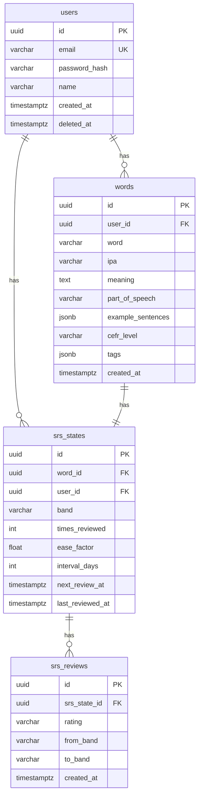

# Database Schema & ERD

## Tada Learn English

| Field | Value |
|---|---|
| **DBMS** | PostgreSQL 16 + pgvector + pg_trgm |

## 1. Entity Relationship Diagram



## 2. Table Definitions

### users
```sql
CREATE TABLE users (
    id UUID PRIMARY KEY DEFAULT gen_random_uuid(),
    email VARCHAR(255) NOT NULL UNIQUE,
    password_hash VARCHAR(255) NOT NULL,
    name VARCHAR(100) NOT NULL,
    created_at TIMESTAMPTZ NOT NULL DEFAULT NOW(),
    updated_at TIMESTAMPTZ NOT NULL DEFAULT NOW(),
    deleted_at TIMESTAMPTZ
);
```

### words
```sql
CREATE TABLE words (
    id UUID PRIMARY KEY DEFAULT gen_random_uuid(),
    user_id UUID NOT NULL REFERENCES users(id),
    word VARCHAR(255) NOT NULL,
    pronunciation VARCHAR(500),
    ipa VARCHAR(255),
    meaning TEXT NOT NULL,
    part_of_speech VARCHAR(50),
    example_sentences JSONB DEFAULT '[]',
    cefr_level VARCHAR(3) CHECK (cefr_level IN ('A1','A2','B1','B2','C1','C2')),
    tags JSONB DEFAULT '[]',
    metadata JSONB DEFAULT '{}',
    created_at TIMESTAMPTZ NOT NULL DEFAULT NOW(),
    updated_at TIMESTAMPTZ NOT NULL DEFAULT NOW(),
    deleted_at TIMESTAMPTZ,
    UNIQUE(user_id, word, deleted_at)
);

CREATE INDEX idx_words_word_trgm ON words USING GIN (word gin_trgm_ops);
CREATE INDEX idx_words_meaning_trgm ON words USING GIN (meaning gin_trgm_ops);
CREATE INDEX idx_words_active ON words(user_id, created_at DESC) WHERE deleted_at IS NULL;
```

### srs_states
```sql
CREATE TABLE srs_states (
    id UUID PRIMARY KEY DEFAULT gen_random_uuid(),
    word_id UUID NOT NULL REFERENCES words(id) ON DELETE CASCADE,
    user_id UUID NOT NULL REFERENCES users(id) ON DELETE CASCADE,
    band VARCHAR(20) NOT NULL DEFAULT 'new'
        CHECK (band IN ('new','learning','reviewing','mature','mastered')),
    times_reviewed INT NOT NULL DEFAULT 0,
    ease_factor FLOAT NOT NULL DEFAULT 2.5,
    interval_days INT NOT NULL DEFAULT 0,
    last_reviewed_at TIMESTAMPTZ,
    next_review_at TIMESTAMPTZ,
    created_at TIMESTAMPTZ NOT NULL DEFAULT NOW(),
    updated_at TIMESTAMPTZ NOT NULL DEFAULT NOW(),
    UNIQUE(word_id, user_id)
);

CREATE INDEX idx_srs_next_review ON srs_states(user_id, next_review_at);
CREATE INDEX idx_srs_band ON srs_states(user_id, band);
```

### srs_reviews
```sql
CREATE TABLE srs_reviews (
    id UUID PRIMARY KEY DEFAULT gen_random_uuid(),
    srs_state_id UUID NOT NULL REFERENCES srs_states(id),
    user_id UUID NOT NULL REFERENCES users(id),
    rating VARCHAR(10) NOT NULL CHECK (rating IN ('easy','medium','hard')),
    from_band VARCHAR(20) NOT NULL,
    to_band VARCHAR(20) NOT NULL,
    from_interval INT NOT NULL,
    to_interval INT NOT NULL,
    response_time_ms INT,
    created_at TIMESTAMPTZ NOT NULL DEFAULT NOW()
);
```

### refresh_tokens
```sql
CREATE TABLE refresh_tokens (
    id UUID PRIMARY KEY DEFAULT gen_random_uuid(),
    user_id UUID NOT NULL REFERENCES users(id) ON DELETE CASCADE,
    token VARCHAR(512) NOT NULL UNIQUE,
    expires_at TIMESTAMPTZ NOT NULL,
    created_at TIMESTAMPTZ NOT NULL DEFAULT NOW()
);
```

## 3. Migrations

```
db/migrations/
├── 000001_create_users.up.sql
├── 000002_create_words.up.sql
├── 000003_create_srs_states.up.sql
├── 000004_create_srs_reviews.up.sql
└── 000005_create_refresh_tokens.up.sql
```

## 4. Key Queries (sqlc)

### Fuzzy Search
```sql
-- name: SearchWords :many
SELECT * FROM words
WHERE user_id = $1 AND deleted_at IS NULL
  AND (word ILIKE '%' || $2 || '%' OR meaning ILIKE '%' || $2 || '%')
ORDER BY similarity(word, $2) DESC
LIMIT $3 OFFSET $4;
```

### Review Queue
```sql
-- name: GetReviewQueue :many
SELECT w.*, s.band, s.times_reviewed
FROM srs_states s JOIN words w ON w.id = s.word_id
WHERE s.user_id = $1 AND s.next_review_at <= NOW()
ORDER BY s.next_review_at ASC LIMIT $2;
```

## 5. Extensions
```sql
CREATE EXTENSION IF NOT EXISTS pg_trgm;
CREATE EXTENSION IF NOT EXISTS pgvector;
```

## 6. Backup
```bash
# Daily: 0 2 * * * pg_dump tada_english | gzip > /backups/tada_english_$(date +\%Y\%m\%d).sql.gz
# Retention: find /backups -name '*.sql.gz' -mtime +30 -delete
```