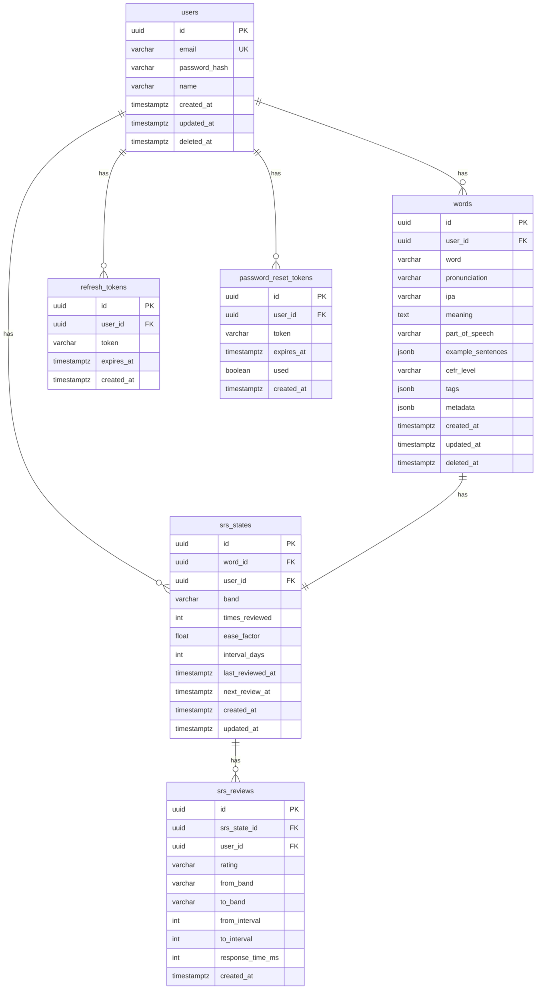

# Database Schema & Entity Relationship Diagram

## Tada Learn English

| Field | Value |
|-------|-------|
| **DBMS** | PostgreSQL 16 + pgvector + pg_trgm |
| **Version** | 1.0.1 |
| **Migrations Tool** | Raw SQL (applied in order via CI/startup script) |

## 1. Entity Relationship Diagram



## 2. Table Definitions

### users

```sql
CREATE TABLE users (
    id UUID PRIMARY KEY DEFAULT gen_random_uuid(),
    email VARCHAR(255) NOT NULL UNIQUE,
    password_hash VARCHAR(255) NOT NULL,
    name VARCHAR(100) NOT NULL,
    created_at TIMESTAMPTZ NOT NULL DEFAULT NOW(),
    updated_at TIMESTAMPTZ NOT NULL DEFAULT NOW(),
    deleted_at TIMESTAMPTZ
);
```

**Notes:** Soft-delete supported via `deleted_at`. Email uniqueness enforced by DB constraint. Password hash is bcrypt output (60 chars stored in VARCHAR 255).

### words

```sql
CREATE TABLE words (
    id UUID PRIMARY KEY DEFAULT gen_random_uuid(),
    user_id UUID NOT NULL REFERENCES users(id),
    word VARCHAR(255) NOT NULL,
    pronunciation VARCHAR(500),
    ipa VARCHAR(255),
    meaning TEXT NOT NULL,
    part_of_speech VARCHAR(50),
    example_sentences JSONB DEFAULT '[]'::jsonb,
    cefr_level VARCHAR(3) CHECK (cefr_level IN ('A1','A2','B1','B2','C1','C2')),
    tags JSONB DEFAULT '[]'::jsonb,
    metadata JSONB DEFAULT '{}'::jsonb,
    created_at TIMESTAMPTZ NOT NULL DEFAULT NOW(),
    updated_at TIMESTAMPTZ NOT NULL DEFAULT NOW(),
    deleted_at TIMESTAMPTZ,
    UNIQUE(user_id, word, deleted_at)
);

CREATE INDEX idx_words_word_trgm ON words USING GIN (word gin_trgm_ops);
CREATE INDEX idx_words_meaning_trgm ON words USING GIN (meaning gin_trgm_ops);
CREATE INDEX idx_words_active ON words(user_id, created_at DESC) WHERE deleted_at IS NULL;
```

**Notes:** Unique constraint on `(user_id, word, deleted_at)` prevents duplicate active words but allows reusing a deleted word. `pg_trgm` GIN indexes enable fast ILIKE fuzzy search. Partial index `idx_words_active` optimizes the common query pattern (list active words for a user).

### srs_states

```sql
CREATE TABLE srs_states (
    id UUID PRIMARY KEY DEFAULT gen_random_uuid(),
    word_id UUID NOT NULL REFERENCES words(id) ON DELETE CASCADE,
    user_id UUID NOT NULL REFERENCES users(id) ON DELETE CASCADE,
    band VARCHAR(20) NOT NULL DEFAULT 'new'
        CHECK (band IN ('new','learning','reviewing','mature','mastered')),
    times_reviewed INT NOT NULL DEFAULT 0,
    ease_factor FLOAT NOT NULL DEFAULT 2.5,
    interval_days INT NOT NULL DEFAULT 0,
    last_reviewed_at TIMESTAMPTZ,
    next_review_at TIMESTAMPTZ,
    created_at TIMESTAMPTZ NOT NULL DEFAULT NOW(),
    updated_at TIMESTAMPTZ NOT NULL DEFAULT NOW(),
    UNIQUE(word_id, user_id)
);

CREATE INDEX idx_srs_next_review ON srs_states(user_id, next_review_at)
    WHERE next_review_at IS NOT NULL;
CREATE INDEX idx_srs_band ON srs_states(user_id, band);
```

**Notes:** One SRS state per word per user (enforced by `UNIQUE(word_id, user_id)`). Cascade delete ensures SRS state is removed when word is deleted. Partial index on `next_review_at` optimizes the review queue query.

### srs_reviews

```sql
CREATE TABLE srs_reviews (
    id UUID PRIMARY KEY DEFAULT gen_random_uuid(),
    srs_state_id UUID NOT NULL REFERENCES srs_states(id),
    user_id UUID NOT NULL REFERENCES users(id),
    rating VARCHAR(10) NOT NULL CHECK (rating IN ('easy','medium','hard')),
    from_band VARCHAR(20) NOT NULL,
    to_band VARCHAR(20) NOT NULL,
    from_interval INT NOT NULL,
    to_interval INT NOT NULL,
    response_time_ms INT,
    created_at TIMESTAMPTZ NOT NULL DEFAULT NOW()
);

CREATE INDEX idx_srs_reviews_user ON srs_reviews(user_id, created_at DESC);
```

**Notes:** Audit log of every review. Used for computing accuracy rate, streak, and analytics. `response_time_ms` is optional (NULL if not measured).

### refresh_tokens

```sql
CREATE TABLE refresh_tokens (
    id UUID PRIMARY KEY DEFAULT gen_random_uuid(),
    user_id UUID NOT NULL REFERENCES users(id) ON DELETE CASCADE,
    token_hash VARCHAR(255) NOT NULL,
    expires_at TIMESTAMPTZ NOT NULL,
    created_at TIMESTAMPTZ NOT NULL DEFAULT NOW()
);

CREATE INDEX idx_refresh_tokens_user ON refresh_tokens(user_id);
```

**Notes:** Token stored as SHA-256 hash (not plaintext). Expired tokens are not automatically cleaned — cleanup job can be added later. Cascade delete removes all refresh tokens when user is deleted.

### password_reset_tokens

```sql
CREATE TABLE password_reset_tokens (
    id UUID PRIMARY KEY DEFAULT gen_random_uuid(),
    user_id UUID NOT NULL REFERENCES users(id) ON DELETE CASCADE,
    token_hash VARCHAR(255) NOT NULL,
    expires_at TIMESTAMPTZ NOT NULL,
    used BOOLEAN NOT NULL DEFAULT false,
    created_at TIMESTAMPTZ NOT NULL DEFAULT NOW()
);

CREATE INDEX idx_reset_tokens_user ON password_reset_tokens(user_id);
```

**Notes:** Token is single-use (`used` flag). Expires after 1 hour. Hash stored (not plaintext) to prevent DB read attacks.

## 3. Migrations

### Current State

| Migration | Description | Status |
|-----------|-------------|--------|
| `000001_initial_schema.up.sql` | Create users, words, srs_states, srs_reviews, refresh_tokens | ❌ Missing |
| `000002_password_reset_tokens.up.sql` | Add password_reset_tokens table | ✅ Exists |
| `000002_password_reset_tokens.down.sql` | Drop password_reset_tokens table | ✅ Exists |

### Required Migrations

```
db/migrations/
├── 000001_initial_schema.up.sql      -- CREATE all base tables + indexes + extensions
├── 000001_initial_schema.down.sql    -- DROP all base tables + indexes
├── 000002_password_reset_tokens.up.sql    -- CREATE password_reset_tokens
└── 000002_password_reset_tokens.down.sql  -- DROP password_reset_tokens
```

**000001_initial_schema.up.sql** should contain:
- CREATE EXTENSION pg_trgm
- CREATE TABLE users
- CREATE TABLE words (with indexes)
- CREATE TABLE srs_states (with indexes)
- CREATE TABLE srs_reviews (with indexes)
- CREATE TABLE refresh_tokens (with indexes)
- CREATE UNIQUE INDEX on words(user_id, word) WHERE deleted_at IS NULL

### Migration Execution Order

```bash
# Applied via CI or startup script
for f in db/migrations/*.up.sql; do
    psql "$DATABASE_URL" -f "$f"
done
```

## 4. Key Queries

### Fuzzy Search (Implemented)

```sql
SELECT id, word, pronunciation, ipa, meaning, part_of_speech,
       example_sentences, cefr_level, tags, created_at, updated_at
FROM words
WHERE user_id = $1 AND deleted_at IS NULL
  AND (word ILIKE '%' || $2 || '%' OR meaning ILIKE '%' || $2 || '%')
ORDER BY
    CASE WHEN word ILIKE $2 || '%' THEN 0 ELSE 1 END,
    similarity(word, $2) DESC
LIMIT $3 OFFSET $4;
```

Optimization: Results where word starts with the query prefix are ranked higher (exact prefix match before fuzzy).

### Paginated List (Implemented)

```sql
SELECT count(*) OVER() AS total, w.*
FROM words w
WHERE user_id = $1 AND deleted_at IS NULL
  AND ($2::text IS NULL OR word ILIKE '%' || $2 || '%')
  AND ($3::text IS NULL OR cefr_level = $3)
ORDER BY created_at DESC
LIMIT $4 OFFSET $5;
```

### Review Queue (Planned Sprint 2)

```sql
SELECT w.*, s.band, s.times_reviewed, s.last_reviewed_at, s.next_review_at
FROM srs_states s
JOIN words w ON w.id = s.word_id
WHERE s.user_id = $1
  AND s.next_review_at <= NOW()
  AND w.deleted_at IS NULL
ORDER BY s.next_review_at ASC
LIMIT $2;
```

### SRS Stats (Planned Sprint 2)

```sql
SELECT
    band,
    COUNT(*) as count
FROM srs_states
WHERE user_id = $1
GROUP BY band;
```

## 5. Extensions

```sql
CREATE EXTENSION IF NOT EXISTS pg_trgm;   -- Fuzzy text search (required)
CREATE EXTENSION IF NOT EXISTS pgvector;  -- Vector similarity (future: semantic search)
```

## 6. Backup Strategy

```bash
# Daily backup at 02:00 UTC
0 2 * * * pg_dump tada_english | gzip > /backups/tada_english_$(date +\%Y\%m\%d).sql.gz

# Retention: 30 days
0 3 * * * find /backups -name '*.sql.gz' -mtime +30 -delete

# Manual restore
gunzip -c /backups/tada_english_20260710.sql.gz | psql tada_english
```
