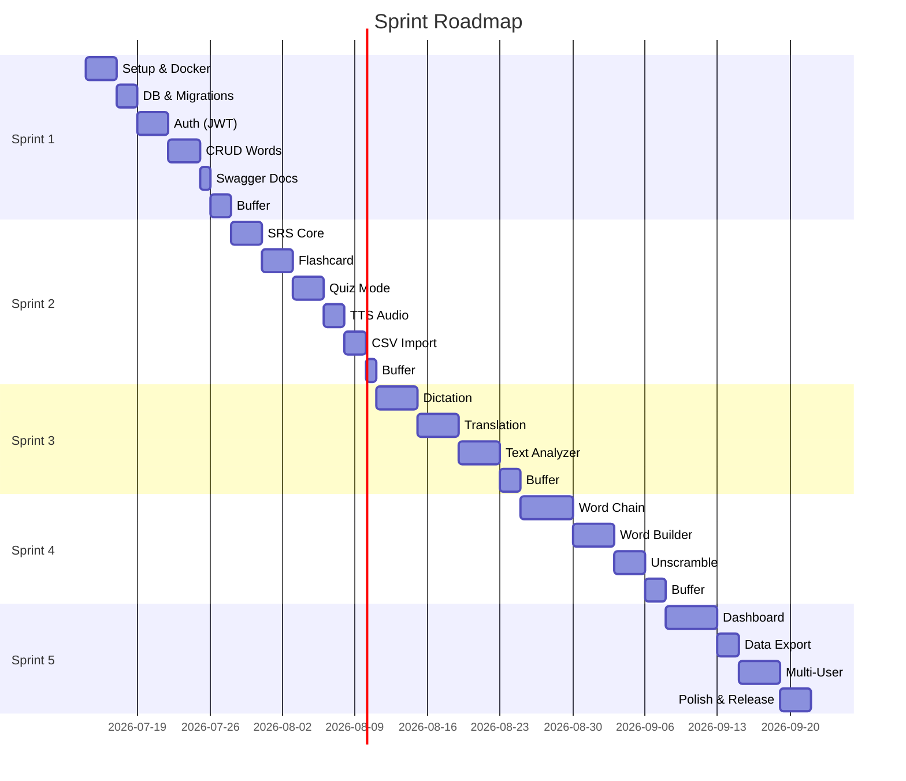

# Sprint Backlog & Product Backlog

## Tada Learn English

| Field | Value |
|---|---|
| **Sprint Length** | 2 weeks |
| **Methodology** | Agile Scrum |

## 1. Sprint Roadmap

## 2. Sprint 1 — MVP Core (Jul 14–28, 2026)

**Goal:** Deployable app with auth and word CRUD.

| ID | Story | Points | Priority |
|---|---|---|---|
| S1-01 | Project scaffold: Go + Next.js + Docker Compose | 5 | P0 |
| S1-02 | Database schema + migrations + pg_trgm | 5 | P0 |
| S1-03 | Register endpoint (POST /api/v1/auth/register) | 3 | P0 |
| S1-04 | Login endpoint + JWT generation | 3 | P0 |
| S1-05 | Password reset flow | 3 | P1 |
| S1-06 | JWT auth middleware (Go chi) | 3 | P0 |
| S1-07 | Create word endpoint (POST /api/v1/words) | 3 | P0 |
| S1-08 | List/search words endpoint (GET /api/v1/words) | 5 | P0 |
| S1-09 | Get/Update/Delete word endpoints | 3 | P0 |
| S1-10 | Next.js setup + Tailwind + shadcn/ui | 3 | P0 |
| S1-11 | Login/Register pages | 5 | P0 |
| S1-12 | NextAuth.js integration | 5 | P0 |
| S1-13 | Word list page (search, filter, paginate) | 5 | P0 |
| S1-14 | Add word page (form + validation) | 4 | P0 |
| S1-15 | Word detail/edit page | 3 | P1 |
| S1-16 | Swagger annotations + auto-gen docs | 3 | P1 |
| S1-17 | Nginx PM routing + Cloudflare DNS | 2 | P1 |

**Total:** 66 points

**Definition of Done:**
- [x] Docker builds and runs
- [x] DB migrations run on startup
- [x] Register/Login via API
- [x] CRUD words via API
- [x] Swagger UI accessible
- [x] Frontend login works
- [x] Word list with search visible
- [x] App accessible at tada-english.dangddt.io.vn

## 3. Sprint 2 — SRS & Learning (Jul 28–Aug 11, 2026)

**Goal:** SRS engine, flashcard and quiz modes.

| ID | Story | Points |
|---|---|---|
| S2-01 | SRS core algorithm (SM-2) + review queue | 8 |
| S2-02 | Auto-create srs_states on word add | 2 |
| S2-03 | Review endpoint (POST /api/v1/srs/review) | 5 |
| S2-04 | Review queue endpoint (GET /api/v1/srs/queue) | 3 |
| S2-05 | SRS stats endpoint | 3 |
| S2-06 | Flashcard study page | 8 |
| S2-07 | Vocabulary quiz page | 8 |
| S2-08 | Study mode selector | 3 |
| S2-09 | TTS integration | 5 |
| S2-10 | CSV import page | 5 |

**Total:** 50 points

## 4. Sprint 3 — Practice Modes (Aug 11–25, 2026)

| ID | Story | Points |
|---|---|---|
| S3-01 | Spelling dictation | 8 |
| S3-02 | Translation practice (VI→EN) | 8 |
| S3-03 | Text analyzer (extract words + CEFR) | 8 |
| S3-04 | Multi-accent TTS | 3 |

**Total:** 27 points

## 5. Sprint 4 — Games (Aug 25–Sep 8, 2026)

| ID | Story | Points |
|---|---|---|
| S4-01 | Word Chain game (bot AI) | 8 |
| S4-02 | Word Builder game | 5 |
| S4-03 | Unscramble game | 5 |

**Total:** 18 points

## 6. Sprint 5 — Analytics & Multi-User (Sep 8–22, 2026)

| ID | Story | Points |
|---|---|---|
| S5-01 | Dashboard with charts | 8 |
| S5-02 | Data export (CSV/JSON) | 3 |
| S5-03 | Multi-user isolation | 5 |
| S5-04 | Dark mode + responsive design | 5 |
| S5-05 | Polish & release | 5 |

**Total:** 26 points

## 7. Product Backlog (Future)

| ID | Story | Notes |
|---|---|---|
| PB-01 | Mobile app (Flutter) | Bro's Flutter skills |
| PB-02 | Dictionary API auto-fill | Cambridge/Oxford API |
| PB-03 | AI example sentences | OpenAI/Claude |
| PB-04 | Social features | Share lists, leaderboard |
| PB-05 | Push notifications | Mobile SRS reminders |
| PB-06 | Offline mode (PWA) | IndexedDB |
| PB-07 | Semantic search (pgvector) | Similar word search |
| PB-08 | Anki export/import | Anki format |
| PB-09 | Browser extension | Highlight → save |

## 8. Risk Register

| Risk | Impact | Mitigation |
|---|---|---|
| Go learning curve | High | Start simple, AI pair programming |
| NextAuth+Go JWT integration | Medium | Standard JWT, verify in Go middleware |
| SRS complexity | Medium | SM-2 is well-documented, test with real data |
| Scope creep | High | Strict sprint scope, PO approval for changes |
| VPS resource limits | Low | Monitor with docker stats |