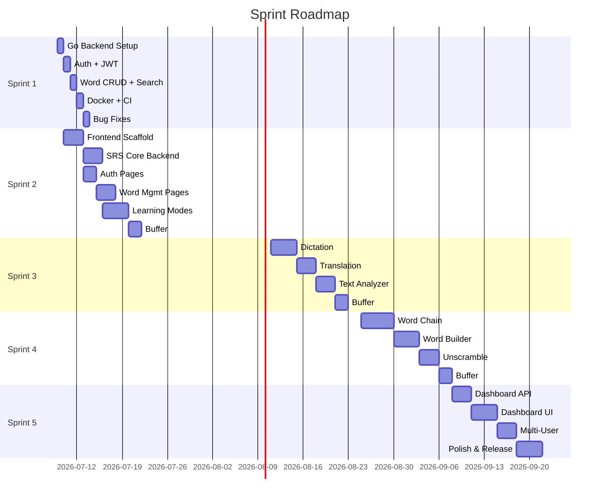

# Sprint Backlog & Product Backlog

## Tada Learn English

| Field | Value |
|-------|-------|
| **Sprint Length** | ~2 weeks |
| **Methodology** | Agile Scrum (single developer variant) |
| **Related Docs** | [PRD](00-PRD.md), [Sprint Plan](06-Sprint-Plan.md) |

## 1. Sprint Roadmap

## 2. Sprint 1 — Backend MVP (Completed: Jul 10, 2026)

**Goal:** Go REST API with auth + word CRUD + Docker + CI.

**Note:** Sprint 1 scope was reduced to backend-only. Frontend tasks moved to Sprint 2.

| ID | Story | Points | Status |
|----|-------|--------|--------|
| S1-01 | Project scaffold: Go module, chi router, config | 3 | ✅ |
| S1-02 | Database schema: users + words + srs_states + srs_reviews + refresh_tokens | 5 | ✅ |
| S1-03 | Register endpoint (POST /api/v1/auth/register) | 3 | ✅ |
| S1-04 | Login endpoint + JWT generation | 3 | ✅ |
| S1-05 | Password reset flow (forgot + reset) | 5 | ✅ |
| S1-06 | JWT auth middleware (Go chi) | 3 | ✅ |
| S1-07 | Create word endpoint (POST /api/v1/words) | 3 | ✅ |
| S1-08 | List/search words endpoint (GET /api/v1/words) | 5 | ✅ |
| S1-09 | Get/Update/Delete word endpoints | 5 | ✅ |
| S1-10 | Bulk CSV import | 5 | ✅ |
| S1-11 | Dockerfile + docker-compose.yml | 3 | ✅ |
| S1-12 | Swagger annotations + auto-gen | 3 | ✅ |
| S1-13 | Bruno API tests + GitHub Actions CI | 5 | ✅ |
| S1-14 | Bug fixes: syntax, race conditions, edge cases | 8 | ✅ |

**Total:** 59 points ✅ **Completed**

**Deliverables:**
- [x] Go REST API with chi router (JWT auth, word CRUD, swagger)
- [x] PostgreSQL schema + migrations
- [x] Docker Compose (backend + PostgreSQL)
- [x] GitHub Actions CI (migration + Bruno API tests)

---

## 3. Sprint 2 — SRS & Frontend (Jul 10 – Aug 11, 2026)

**Goal:** SRS engine + frontend scaffold + learning UI.

| ID | Story | Points | SRS Ref | Priority |
|----|-------|--------|---------|----------|
| S2-01 | Next.js scaffold + Tailwind + shadcn/ui + API client | 8 | — | P0 |
| S2-02 | Frontend auth pages (login, register, forgot/reset) | 8 | FR-6.1, 6.2 | P0 |
| S2-03 | Frontend word management (list, add, edit, import) | 8 | FR-1.1→1.4 | P0 |
| S2-04 | SRS core algorithm (SM-2 5-band) + auto-create on word add | 8 | FR-2.1, 2.2 | P0 |
| S2-05 | Review queue endpoint (GET /api/v1/srs/queue) | 3 | FR-2.4 | P0 |
| S2-06 | Review endpoint (POST /api/v1/srs/review) | 5 | FR-2.3 | P0 |
| S2-07 | SRS stats endpoint | 3 | FR-2.5 | P1 |
| S2-08 | Flashcard API + frontend page | 8 | FR-3.1 | P0 |
| S2-09 | Quiz API + frontend page | 8 | FR-3.2 | P0 |
| S2-10 | TTS integration (API + audio player) | 5 | FR-7.1 | P1 |
| S2-11 | CSV import page (frontend) | 5 | FR-1.5 | P1 |

**Total:** 69 points
**Definition of Done:**
- [ ] SRS: words auto-scheduled, review queue works, ratings update bands
- [ ] Frontend: user can register, login, see word list, add words
- [ ] Learning: flashcard review + quiz fully functional
- [ ] Bruno tests updated for SRS endpoints
- [ ] `go build` + `go vet` + `golangci-lint` pass

---

## 4. Sprint 3 — Practice Modes (Aug 11–25, 2026)

| ID | Story | Points |
|----|-------|--------|
| S3-01 | Spelling dictation API (fill missing word) | 5 |
| S3-02 | Sentence dictation API (listen and type) | 5 |
| S3-03 | Frontend dictation pages | 8 |
| S3-04 | Translation VI→EN API | 5 |
| S3-05 | Translation page (frontend) | 5 |
| S3-06 | Text analyzer API (extract words + CEFR) | 8 |
| S3-07 | Text analyzer page (frontend) | 5 |
| S3-08 | Multi-accent TTS (US/UK) | 3 |

**Total:** 44 points

---

## 5. Sprint 4 — Games (Aug 25–Sep 8, 2026)

| ID | Story | Points |
|----|-------|--------|
| S4-01 | Word Chain game engine + API | 8 |
| S4-02 | Word Chain frontend UI | 5 |
| S4-03 | Word Builder game engine + API | 5 |
| S4-04 | Word Builder frontend UI | 3 |
| S4-05 | Unscramble game engine + API | 5 |
| S4-06 | Unscramble frontend UI | 3 |

**Total:** 29 points

---

## 6. Sprint 5 — Analytics & Multi-User (Sep 8–22, 2026)

| ID | Story | Points |
|----|-------|--------|
| S5-01 | Dashboard API (total words, activity, streak) | 5 |
| S5-02 | CEFR distribution API | 3 |
| S5-03 | Daily activity API | 3 |
| S5-04 | Dashboard frontend with charts | 8 |
| S5-05 | Data export API (JSON/CSV) | 5 |
| S5-06 | Data export frontend page | 3 |
| S5-07 | Multi-user isolation (backend) | 5 |
| S5-08 | User profile page (change password, settings) | 3 |
| S5-09 | Dark mode + responsive polish | 5 |
| S5-10 | Release: deploy + verify + docs | 5 |

**Total:** 45 points

---

## 7. Product Backlog (Future)

| ID | Story | Notes | Dependencies |
|----|-------|-------|-------------|
| PB-01 | Mobile app (Flutter) | Cross-platform vocabulary app | Sprint 5 completion |
| PB-02 | Dictionary API auto-fill | Cambridge/Oxford API lookup | — |
| PB-03 | AI example sentences | OpenAI/Claude API for context | — |
| PB-04 | Social features | Share lists, leaderboard | Multi-user done |
| PB-05 | Push notifications | Mobile SRS reminders | Mobile app done |
| PB-06 | Offline mode (PWA) | IndexedDB + service worker | — |
| PB-07 | Semantic search (pgvector) | Similar word search by meaning | — |
| PB-08 | Anki import/export | Anki APKG format | — |
| PB-09 | Browser extension | Highlight → save word | API stable |

---

## 8. Risk Register

| Risk | Impact | Probability | Mitigation |
|------|--------|-------------|------------|
| Single developer bottleneck | Missed deadlines | High | Vertical slicing, AI pair programming |
| No frontend experience | Poor UX / slow frontend | High | shadcn/ui + Tailwind templates |
| SRS algorithm too complex | Over-engineered MVP | Medium | Start simple SM-2, iterate based on feedback |
| Scope creep | Sprint overflow | High | Strict sprint boundaries, say no to gold-plating |
| VPS resource limits | Performance issues | Low | Docker resource limits, `docker stats` monitoring |
| Go module maturity | Unexpected bugs | Low | Pin versions, use stable releases |
| No unit tests | Regression bugs | High | Mandatory tests for all service methods |
